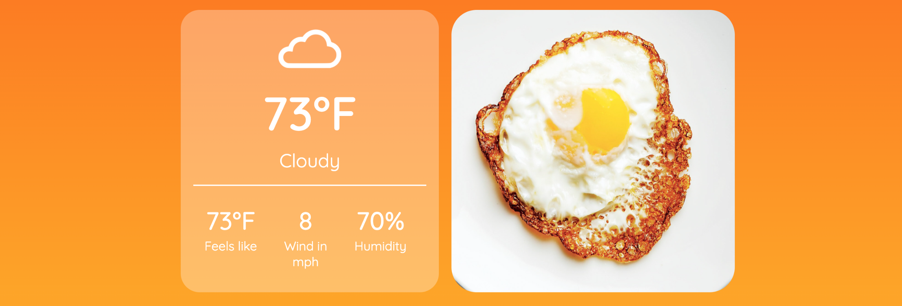
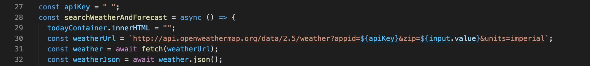

# Sunny Side Up

## Video Walk Through:

https://youtu.be/3X9yLwFWr_w

## Overview:

Sunny Side Up is a weather app that loads daily weather and weekly forecast for a city that the user looks up. Different egg images are loaded in the weather app depending on what the weather is for the day. The app merges functionality with entertainment for an enjoyable user experience.

## What I Used:

### Languages:

- HTML
- CSS
- Javascript

### API:

- [Open Weather Map](https://openweathermap.org/api)

## Notes:

- In order to test the app, you must insert your own Open Weather Map api key in the apiKey variable string on line 27.

- Check out my [Dev To blog post](https://openweathermap.org/api) about this project!
